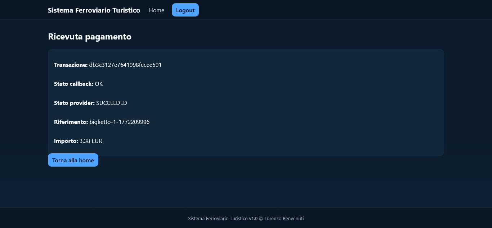
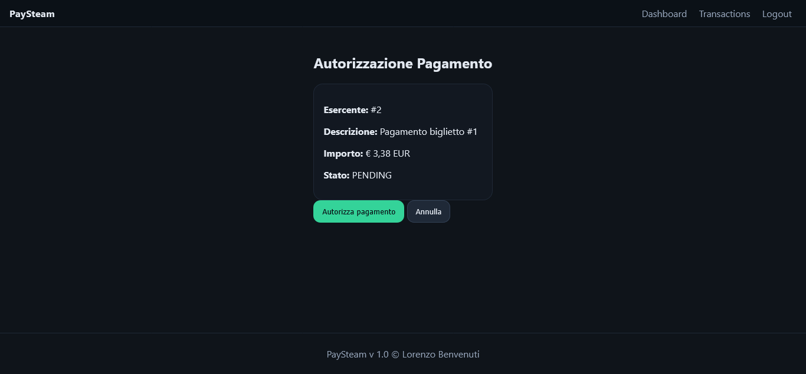
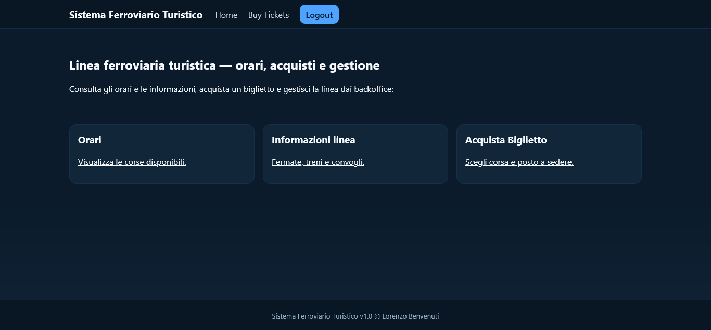
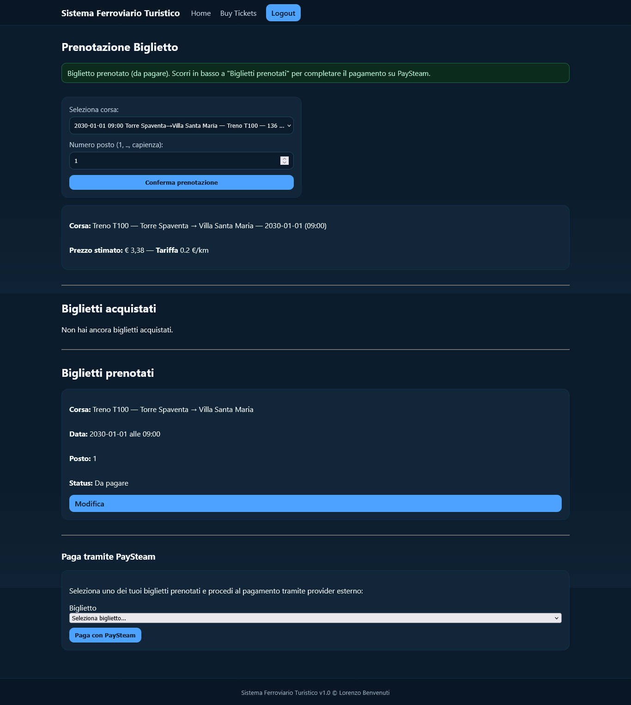
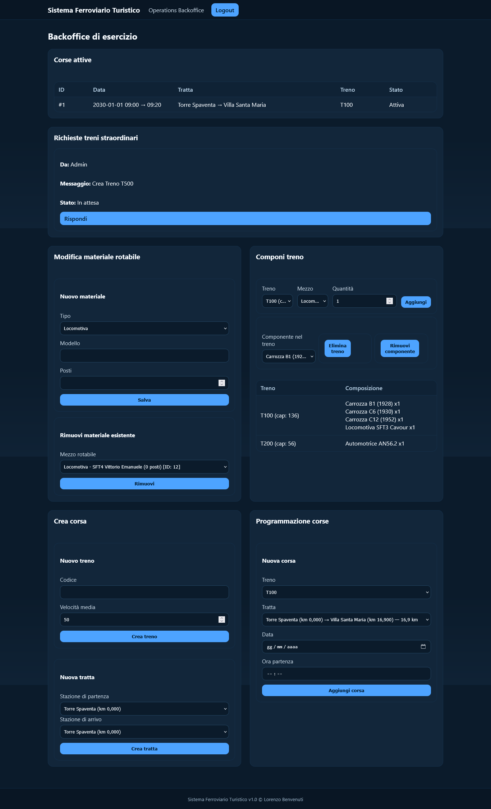
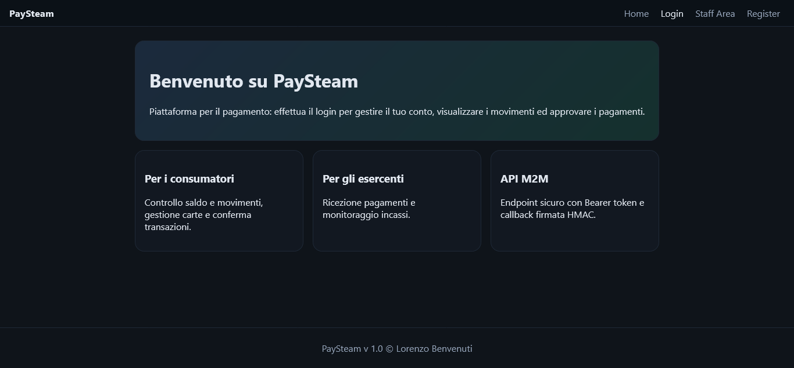
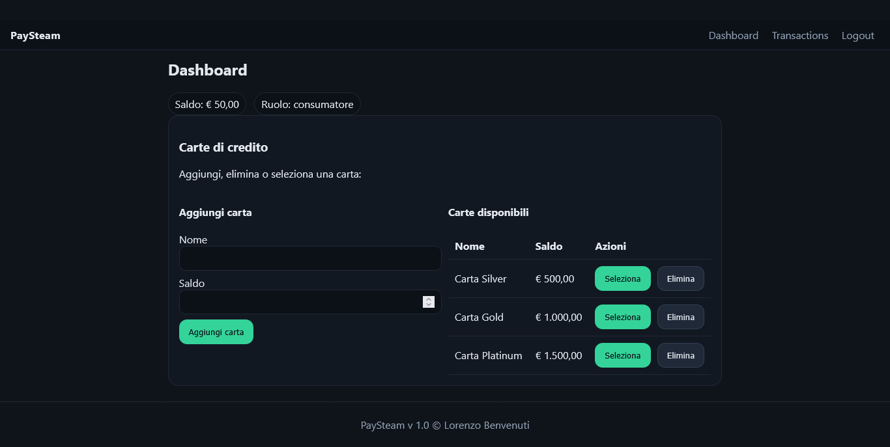
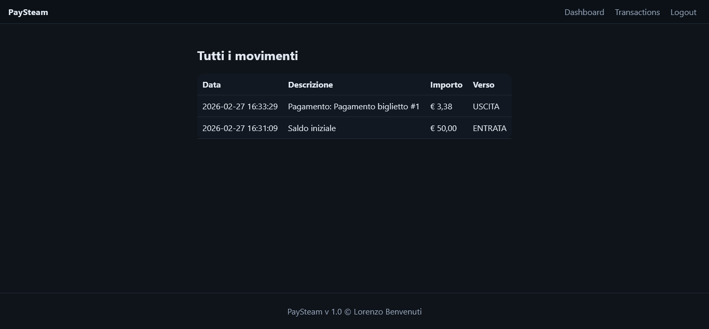

# Transport Ticketing & Payment System (SFT + PaySteam)

> Full-stack project simulating a real-world ticketing system integrated with a payment service provider (PSP), designed with Dockerized local reproducibility and webhook-based payment confirmation.

[](https://github.com/Lorenzo-Benvenuti/Transport-Ticketing-and-Payment-System/actions/workflows/php-lint.yml)
[](LICENSE)
[](docker-compose.yml)
[](#tech-stack)

Two full‑stack **PHP + MySQL** web applications in one repo:

- **SFT** — public transport ticketing system (routes/schedules, ticket purchase, admin/operations backoffice)
- **PaySteam** — payment/wallet system (consumer dashboard, merchant area, signed callback simulation)

## Screenshots

**SFT — Checkout**


**PaySteam — Payment approval**


<details>
  <summary>More screenshots</summary>

  <figure>
    <figcaption><strong>SFT — Dashboard</strong></figcaption>
    
  </figure>

  <figure>
    <figcaption><strong>SFT — Ticket Section</strong></figcaption>
    
  </figure>

  <figure>
    <figcaption><strong>SFT — Admin Backoffice</strong></figcaption>
    
  </figure>

  <figure>
    <figcaption><strong>SFT — Operations Backoffice</strong></figcaption>
    
  </figure>

  <figure>
    <figcaption><strong>PaySteam — Dashboard</strong></figcaption>
    
  </figure>

  <figure>
    <figcaption><strong>PaySteam — User Dashboard</strong></figcaption>
    
  </figure>

  <figure>
    <figcaption><strong>PaySteam — Transactions</strong></figcaption>
    
  </figure>

</details>

## Tech stack

- PHP (procedural)
- MySQL
- Apache
- Docker Compose (recommended)
- XAMPP (supported, but payment demo requires extra configuration)

## Project structure

- `sft/` — SFT application
- `paysteam/` — PaySteam application
- `docker/` — Docker Compose + MySQL init scripts
- `docs/` — PDFs (project reports)

## What this project demonstrates

- Two-service architecture (Ticketing + Payment Provider simulator)
- Webhook-based confirmation (PaySteam → SFT) with HMAC signature verification
- Clear separation between PUBLIC vs INTERNAL base URLs (browser vs server-to-server inside Docker)
- Reproducible local setup (Docker Compose + DB init scripts)
- Baseline automation via GitHub Actions (lint/tests)

## Quick start (Docker — recommended)

### TL;DR
```bash
cp sft/.env.example sft/.env
cp paysteam/.env.example paysteam/.env
docker compose up -d --build
```

### 1) Create env files
Copy the examples:

- `sft/.env.example` → `sft/.env`
- `paysteam/.env.example` → `paysteam/.env`

> The examples are configured for Docker (DB host `db`).
>
> **Important:** the payment demo distinguishes URLs used by the **browser** vs URLs used for **server-to-server** calls inside Docker.
> Use the table below as reference.

### 2) Start containers

> Note: the PHP image is built locally to include required extensions (`mysqli`, `pdo_mysql`, `curl`) and Apache modules.

From the repo root:

```bash
docker compose up -d --build
```

### 3) Open apps
- SFT: http://localhost:8080/sft/public/index.php
- PaySteam: http://localhost:8080/paysteam/public/index.php

### URL configuration reference (Docker)

| Variable | App | Used by | Example | Notes |
|---|---|---|---|---|
| `PUBLIC_BASE_URL` | SFT | Browser redirects/return URL | `http://localhost:8080/sft` | Host/port exposed by Docker |
| `INTERNAL_BASE_URL` | SFT | PaySteam → SFT webhook (server-to-server) | `http://localhost/sft` | Inside the `php` container (port 80) |
| `PAYSTEAM_BASE_URL` | SFT | SFT → PaySteam API/result (server-to-server) | `http://localhost/paysteam` | Inside the `php` container (port 80) |
| `PAYSTEAM_MERCHANT_EMAIL` | SFT | Identity of the merchant on PaySteam | `esercente@paysteam.it` | Must exist in PaySteam with role `esercente` |
| `APP_BASE_URL` | Paysteam | URLs shown to the browser | `http://localhost:8080/paysteam` | Host/port exposed by Docker |


### 4) Reset DB (if you need a clean start)
```bash
docker compose down -v
docker compose up -d --build
```

## Demo credentials

### SFT
- Admin: `admin@sft.it` / `admin123`
- Operations: `responsabile@sft.it` / `responsabile123`
- Passenger: `utente@example.com` / `utente123`

### PaySteam
- Consumer: `utente@example.com` / `utente123`
- Merchant: `esercente@paysteam.it` / `merchant123`

## Notes on the payment demo

The SFT checkout flow is wired to the PaySteam simulator via HTTP calls and return/webhook URLs.

- **Docker (recommended):** works out of the box (examples include the correct PUBLIC vs INTERNAL base URLs for Docker).
- **XAMPP:** you must set base URLs in `sft/.env` and `paysteam/.env` to your local Apache URL (typically `http://localhost/...`).

Also note: the demo payment flow resolves users by **email** (recommended) to avoid cross‑DB ID coupling. Make sure the same email exists in both apps (seeded: `utente@example.com`).

## Security notes

This is a simulation project. It includes basic security practices (prepared statements, password hashing, env‑based secrets, hardened session cookies), but it is **not intended for production yet**.

## Architecture overview

```text
+------------------+       HTTP (API/redirect)      +------------------+
| SFT (Ticketing)  |  --------------------------->  | PaySteam (PSP)   |
| - orders/tickets |                                | - payments       |
| - backoffice     |  <---------------------------  | - webhook sender |
+------------------+      Signed webhook/callback   +------------------+
          |
          | MySQL (init scripts)
          v
      +--------+
      |   DB   |
      +--------+
```
The repository contains two PHP web apps communicating over HTTP.

- **SFT** (ticketing app): manages users, routes/schedules, and the checkout flow.
- **PaySteam** (payment simulator): provides consumer/merchant dashboards and a mock payment API.

### Payment flow (high level)

1. User starts checkout on **SFT**.
2. **SFT** creates a transaction on **PaySteam** via server-to-server call.
3. Browser is redirected to **PaySteam** to approve/deny the payment.
4. **PaySteam** notifies **SFT** via a signed webhook.
5. User returns to **SFT** confirmation page (return URL).

**Note: To ensure the success of the transactions, the user must first be logged in with the same account on both applications (SFT and Pay Steam).**

Security mechanisms included:
- Prepared statements (SQLi mitigation)
- Password hashing
- Env-based secrets (API token + webhook secret)
- HMAC-signed callback from PaySteam

## License

MIT
